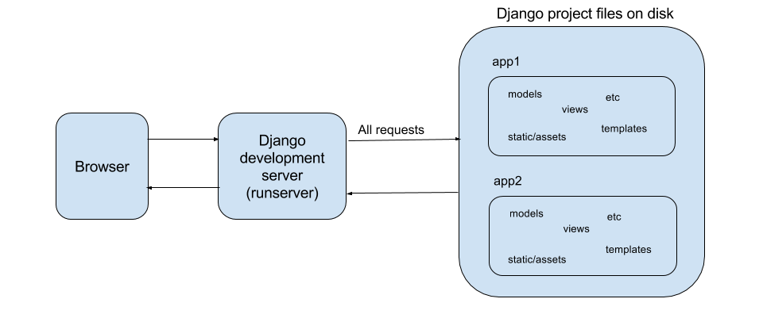
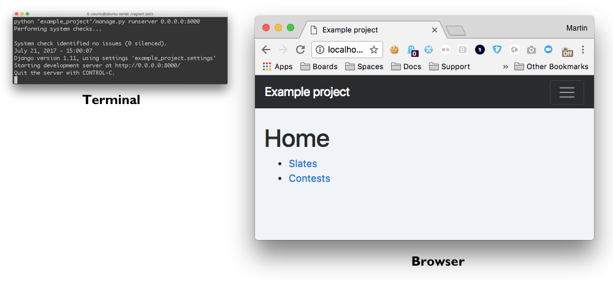
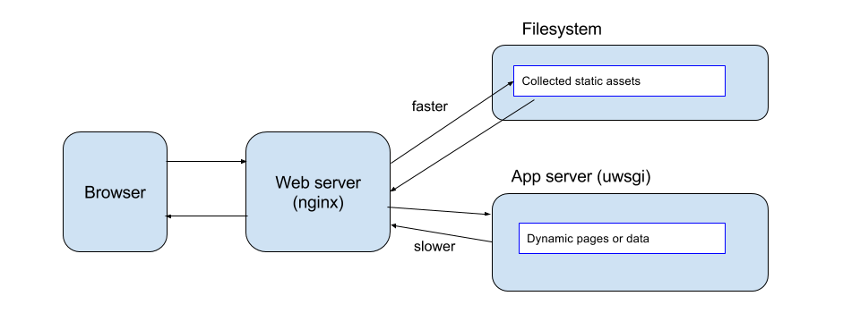
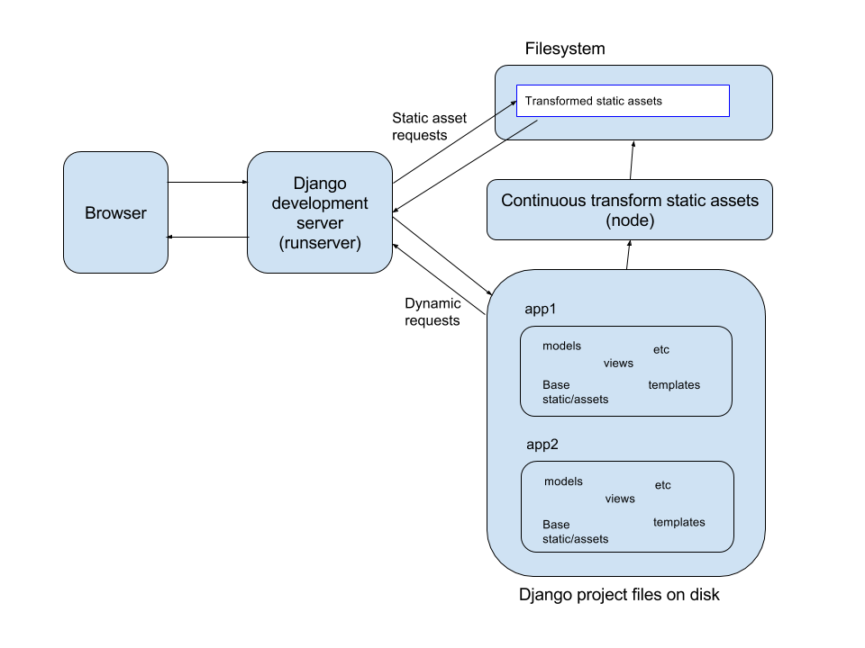
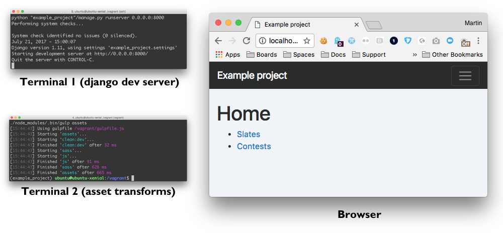
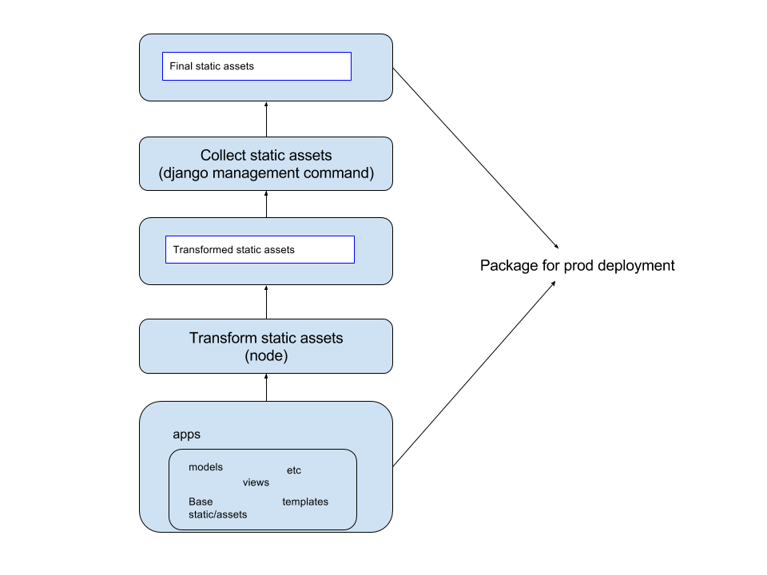

# A technique for serving compiled assets with Django

The typical way of serving static assets (CSS, JS) is to put them in the /static folder of each app and use the [staticfiles](https://docs.djangoproject.com/en/1.11/howto/static-files/) app (and associated template tags). Referencing a CSS file from a web page template will look like:

```
<link rel="stylesheet" href="" />
```

When you are running the Django development server in development mode and it encounters this template tag in a template, it will turn it into the following rendered HTML:

```
<link rel="stylesheet" href='/static/app1/css/main.css' %}" />
```

When your browser makes an HTTP GET request for the file `/static/app1/css/main.css`, the Django development server will look for this file in the /static folder in your app on disk, and serve it up directly.



Your development workstation is likely to be running the Django development server in a terminal window, with a browser alongside it.



For production deployment, you will typically use the [collectstatic](https://docs.djangoproject.com/en/1.11/ref/contrib/staticfiles/#django-admin-collectstatic) command to gather all of the static files from their individual apps, and place them in a single location. This is so that a web server (for example [nginx](https://www.nginx.com/)) can serve them very efficiently from the file system without having to make a full request to your application server (e.g. [uwsgi](https://uwsgi-docs.readthedocs.io/en/latest/)).




But what if you want to use [Sass](http://sass-lang.com/) instead of CSS, or apply transformations (concatenate, minify) to your JS before it reaches the browser? The simple setup above doesn't cover this on its own. If you serve a Sass file directly to a browser, it won't know what to do with it.

While it is _possible_ to add asset transformation capabilities to the Django development server and to the `collectstatic` pipeline, I have found this to be difficult and inflexible. However, the web front-end world has been dealing with this for a long time, and has tons of solutions available. So let's use them!

The technique illustrated in this repo uses the [gulp](http://gulpjs.com/) task runner on top of [node](https://nodejs.org/en/) to perform the necessary static asset transformations _outside_ the standard Django pipeline. The idea is to let Django do what it's best at -- the dynamic pages and data -- and let dedicated front-end tools take care of the front-end assets. This looks quite a bit like the production setup:



The continuous transformation of static assets is not done by the Django development server, so we now need two terminal windows open. The first one is the same as before - it runs the Django development server. The second one has a task that watches for any changes to static files, and runs the transformation process when needed:



The next step here is to look at how to serve these transformed assets in production. Fortunately, Django makes it easy to use the same collectstatic process as before, but instead of gathering the static assets from the _app_ folders, we tell it to start with the _transformed_ assets as its basis. For one more trick, we can tell it to use the `ManifestStaticFilesStorage` module, which calculates a unique hash for each file and adds it to the filename. This makes each version unique, and allows us to apply far-future headers to static assets for a nice front-end performance optimization.




----

## See it in action

Requirements:

* Vagrant 1.9.x (earlier will probably work, too)

Start up and prepare the VM:

```
vagrant up
vagrant ssh
make requirements
make migrate_all
```

### Dev mode (Django development server)

When the VM is ready, open up two terminal windows

```
# Terminal 1: Django development server
vagrant ssh
make runserver
```

```
# Terminal 2: asset transformer
vagrant ssh
make assetswatch
```

In your browser:

[http://localhost:8000/](http://localhost:8000/)

Use devtools/view source to see CSS/JS requests the browser is making.

If you edit python/Django files, the development server will pick up the changes. If you edit static assets, the assetswatch task will see the changes and update the transformed output. In both cases, you should be able to make your change, wait a couple of seconds, reload page in your browser, and see the changes. (Note: if static file changes aren't visible, your _browser_ may be caching JS and CSS files more aggressively than you need for dev mode.)

### Pseudo-production mode (nginx + uwsgi)

When the VM is ready, this will transform the static assets, package up the code, and deploy it to a local pseudo-production environment based on nginx (web server) and uwsgi (app server).

```
# Terminal 3: package and deploy
vagrant ssh
make deploy_local_prod
```

In your browser:

[http://localhost:8080/](http://localhost:8080/)

Use devtools/view source to see CSS/JS requests the browser is making.

As this pseudo-production environment contains a packaged deployment, when you edit your python/Django files and static assets, you will have to manually trigger a new deployment for those changes to show up here.
